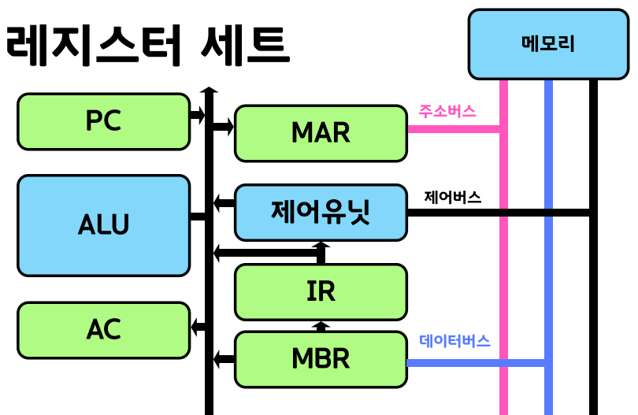

# CPU - IR(Instruction Register)

</img>

## 정의

- 명령 레지스터(Instruction Register, IR) : CPU가 주기억장치(RAM)로부터 읽어온 현재 실행할 명령어(Instruction)를 임시로 저장하는 특수 목적 레지스터.
- CPU가 명령어를 처리할 때 거치는 '명령어 주기(Instruction Cycle)' 중 인출 단계(Fetch Phase)에서 인출된 명령어 코드가 바로 이 IR에 저장됨.

## 주요 기능

- **인출된 명령어 임시 저장 :** 주기억장치에서 데이터 버스를 통해 들어온 명령어 비트 패턴(Machine Code)을 보관.
- **해독기(Decoder)로 명령어 전달 :** IR에 보관된 명령어는 CPU 내부의 명령어 해독기(Instruction Decoder)로 전달되어 어떤 연산(Opcode)을 수행해야 하는지 분석되는 기초 데이터가 됨.
- **연산코드와 피연산자 분할 파이프라인 제공 :** 명령어 구조는 통상 연산자(Opcode)와 피연산자(Operand / 주소)로 나뉘는데, IR은 이 정보를 해독기와 주소 버퍼 등으로 분라해 보내주는 매개체 역할.

## 특징

- **1개의 현재 명령어만 보관 :** IR은 여러 명령어를 쌓아두지 않고, 현재 CPU가 실행하려는 단 하나의 명령어만 담고 있음. (다음 명령어의 주소는 PC가 관리.)
- **PC(Program Counter)와의 밀접한 연관성 :** PC가 가리키는 메모리 주소에서 읽어온 명령어가 IR로 들어오며, IR에 데이터가 정상적으로 저장되면 PC는 자동으로 다음 명령어 주소를 가리키도록 증가(Increment).
- **고속 동작 특성 :** CPU 내부의 레지스터이므로 메모리(RAM)보다 훨씬 빠르게 접근 및 데이터 전송이 가능.
- **명령어 집합 구조(ISA)에 종속적 :** IR의 크기(비트 수)는 해당 CPU가 사용하는 명령어의 길이(예: 32비트, 64비트)와 정확히 일치.

## 요약

| **구분** | **주요 내용** |
| --- | --- |
| **정의 (Definition)** | CPU가 현재 실행 중이거나 실행할 명령어 코드를 임시 저장하는 특수 레지스터 |
| **주요 기능 (Functions)** | • 메모리에서 인출한 명령어 보관 • 명령어 해독기(Decoder)로 데이터 전달 • 연산자(Opcode) 및 피연산자(Operand) 정보 분라 제공 |
| **주요 특징 (Characteristics)** | • 단 하나의 현재 명령어만 저장 • PC(프로그램 카운터)와 연동되어 실행 프로세스 진행 • CPU 명령어 길이(32bit, 64bit 등)와 동일한 크기 보유 |
| **명령어 주기 내 위치** | 인출(Fetch) 단계에서 데이터가 채워지고, 해독(Decode) 단계에서 활용됨 |