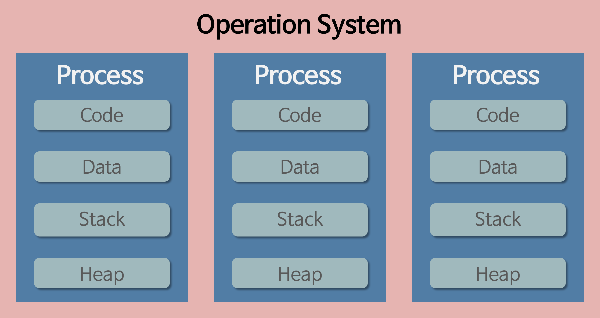

# Process

</img>

| **구분** | **주요 내용** |
| --- | --- |
| **정의** | 메모리에 적재되어 **실행 중인 동적인 프로그램** |
| **구성 요소** | 메모리 영역(Code, Data, Heap, Stack) + PCB(프로세스 제어 블록) |
| **기능** | 독립적 자원 할당, CPU 스케줄링 대상, 프로세스 간 통신(IPC) |
| **장점** | 각 프로세스가 완전히 독립되어 있어 **안전성(보안성)**이 높음 |
| **단점** | 독립된 메모리 구조 때문에 **컨텍스트 스위칭 비용과 자원 소모가 큼** |

## 정의

- 실행 중인 프로그램(Program)
- 프로그램을 실행하여 메모리(RAM)에 적재되고, CPU를 할당받아 동적으로 움직이는 상태가 되면 비로소 '프로세스'가 됨

## 주요 기능

- **자원 할당 및 관리 :** 운영체제로부터 실행에 필요한 독립된 메모리 공간(Code, Data, Stack, Heap)과 CPU 시간, 파일, 입출력 장치 등의 자원을 할당 받는다.
- **CPU 스케줄러와의 상호작용 :** 프로세스는 CPU를 독점할 수 없으므로, 운영체제의 스케줄러에 의해 CPU 할당 시간을 나누어 쓰며 교대로 실행됨.
- **프로세스 간 통신 (IPC) :** 원칙적으로 프로세스는 독립적이지만, 필요에 따라 파이프, 소켓, 공유 메모리 등을 통해 다른 프로세스와 데이터를 주고받을 수 있음.
- **제어 블록(PCB) 생성 :** 운영체제가 프로세스를 관리하기 위해 프로세스의 상태, CPU 레지스터 값, 스케줄러 정보 등을 담은 PCB(Process Control Block)를 생성하고 업데이트.

## 특징

- **독립성 :** 각 프로세스는 자신만의 고유한 주소 공간을 가짐. 따라서 한 프로세스가 오류로 인해 크래시(종료)되더라도 다른 프로세스에는 영향을 주지 않는다.
- **동적 상태 변화**
    - **생성 (New) :** 프로세스가 이제 막 생성된 상태
    - **준비 (Ready) :** CPU를 할당받기 위해 줄을 서서 기다리는 상태
    - **실행 (Running) :** CPU를 차지하고 명령어(코드)를 실행 중인 상태
    - **대기 (Waiting/Blocked) :** 입출력(I/O) 작업 등으로 인해 잠시 멈춘 상태
    - **종료 (Terminated) :** 실행이 끝난 상태
- **컨텍스트 스위칭(Context Switching) 비용 :** CPU가 한 프로세스에서 다른 프로세스로 실행을 넘길 때, 이전 프로세스의 상태를 PCB에 저장하고 새 프로세스의 상태를 불러오는 과정이 필요. 이 과정에서 발생하는 시간과 자원의 소모(오버헤드)가 스레드(Thread)에 비해 크다.