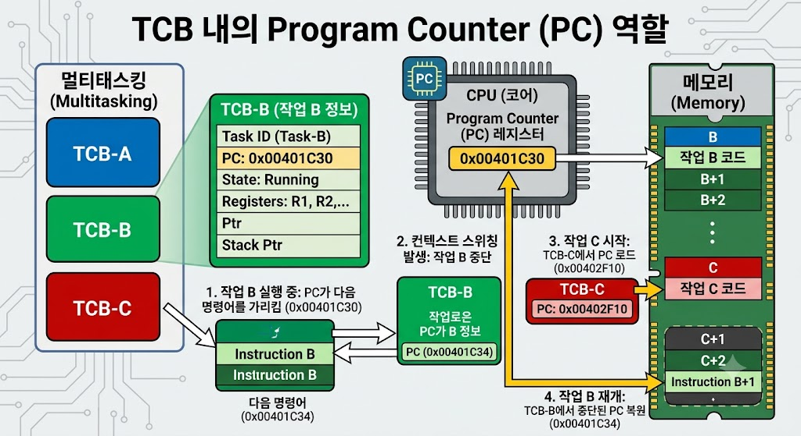

# TCB - PC

</img>

| **구분** | **CPU 레지스터의 PC** | **PCB의 Program Counter** | **TCB의 Program Counter** |
| --- | --- | --- | --- |
| **개념/정의** | CPU 하드웨어 내부의 물리적 레지스터 | 프로세스 제어 블록(PCB)에 저장된 PC 주소 | 스레드 제어 블록(TCB)에 저장된 PC 주소 |
| **실체/위치** | **CPU 내부** (하드웨어 칩) | **OS 커널 메모리** (PCB 구조체 내 변수) | **OS 커널 메모리** (TCB 구조체 내 변수) |
| **수행 역할** | **현재 실제 실행 중인** 명령어의 주소를 가리킴 | 단일 스레드 모델 또는 프로세스 단위 전환 시 PC 백업용 | **다중 스레드 환경에서 각 스레드별** 실행 위치 백업용 |
| **존재 개수** | 코어(Core)당 **1개** 존재 | **프로세스당 1개** (멀티스레딩 환경에서는 TCB로 이관) | **스레드당 1개** |
| **동작 시점** | 매 매뉴얼 클럭 주기마다 CPU가 직접 참조/증가 | 프로세스 문맥 교환(Context Switch) 시 참조 및 업데이트 | 스레드 문맥 교환(Context Switch) 시 참조 및 업데이트 |

## **정의**

- 특정 스레드가 다음에 실행할 기계어 명령어(Instruction)의 메모리 주소를 저장하는 TCB 구조체 내의 필드(변수)
- 스레드는 독립적인 실행 흐름(Thread of Execution)을 가지므로, 같은 프로세스 내의 다른 스레드들과 무관하게 자신만의 코드 실행 위치를 기록해 두어야 함. ⇒ TCB의 PC는 바로 이 실행 위치를 백업/관리하는 역할.

## **주요 기능 및 백업/복원 메커니즘**

- **스레드 문맥 보존 (Context Backup) :**
운영체제의 스케줄러에 의해 현재 실행 중인 스레드가 중단(Preempted/Blocked)될 때, CPU의 PC 레지스터에 들어 있는 현재 실행 주소를 해당 스레드의 TCB PC 필드에 저장.
- **스레드 실행 재개 (Context Restore) :**
해당 스레드가 다시 CPU를 할당받아 실행(Running)될 때, TCB PC에 저장되어 있던 주소 값을 CPU의 PC 레지스터로 복원. 이를 통해 스레드는 이전에 멈췄던 정확한 지점부터 명령어를 계속 수행.
- **독립적 흐름 유지 :**
하나의 프로세스 안에서 여러 스레드가 동시에 각기 다른 함수나 코드를 실행할 수 있도록 보장.

## **특징**

1. **스레드별 독립성 (Per-Thread Basis) :**
프로세스 내의 코드(Text) 영역은 모든 스레드가 공유하지만, TCB PC는 스레드마다 개별적으로 존재.
2. **커널 메모리에 위치 (메모리 구조체 변수) :**
하드웨어 레지스터가 아니라 운영체제 커널의 RAM 영역에 존재하는 데이터 구조체(TCB) 내의 한 멤버 변수.
3. **스레드 문맥 교환(Thread Context Switch)의 핵심 :**
스레드 간 전환 시 메모리 관리 정보(페이지 테이블 등)는 공유되므로 바꿀 필요가 없고, 주로 TCB PC를 포함한 레지스터 세트와 스택 포인터만 교체되므로 문맥 교환 오버헤드가 매우 작다.