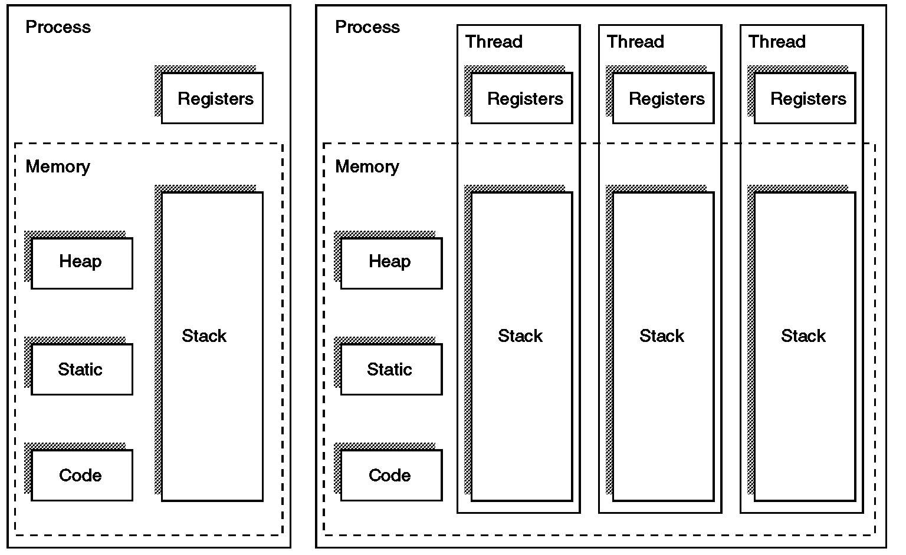

# Thread

| **구분** | **프로세스 (Process)** | **스레드 (Thread)** |
| --- | --- | --- |
| **개념** | 실행 중인 프로그램 (독립된 작업 단위) | 프로세스 내의 실행 흐름 (실행의 주체) |
| **메모리 구조** | Code, Data, Heap, Stack 모두 독립적 | Code, Data, Heap은 **공유**  Stack만 **독립적** |
| **생성/전환 비용** | 큼 (메모리 할당 및 복사 필요) | 작음 (자원을 공유하므로 빠름) |
| **장애 영향** | 다른 프로세스에 영향 없음 | 한 스레드가 죽으면 프로세스 전체 종료 |
| **통신 방식** | IPC(파이프, 소켓 등) 필요 (복잡함) | 공유 메모리를 통해 직접 통신 (간단함) |

</img>

## 정의

- **프로세스(Process)** : 운영체제로부터 메모리와 자원을 할당받는 작업의 단위
- **스레드(Thread)** : 프로세스 안에서 실제로 일을 처리하는 실행의 주체
- 모든 프로세스는 최소한 하나 이상의 스레드를 가짐 → 메인 스레드(Main Thread)
- 만약 하나의 프로세스에서 여러 스레드가 동시에 실행된다면 이를 멀티스레딩(Multithreading)

## 주요 기능

- **실행 흐름의 분리 :** 하나의 프로그램 안에서 동시에 여러 작업 처리 가능
    - Ex) 워드 프로세서에서 글을 입력하는 동안(스레드 1) 오타를 검사하고(스레드 2), 임시 저장을 수행하는(스레드 3) 구조가 가능
- **자원 관리의 효율화 :** 프로세스가 가진 메모리 영역을 공유하므로, 새로운 프로세스를 만드는 것보다 훨씬 적은 비용(시간, 메모리)으로 생성하고 전환이 가능함.
- **사용자 응답성 향상 :** 무거운 작업(예: 대용량 파일 다운로드)을 별도 스레드로 돌리면, 메인 스레드는 사용자의 클릭이나 입력에 즉각 반응할 수 있어 프로그램이 '응답 없음' 상태에 빠지는 것을 방지.

## 핵심 특징

### ① 자원 공유 (Memory Sharing)

- 스레드의 가장 큰 특징은 프로세스의 자원을 공유한다는 점
- **공유하는 영역 :** 프로세스의 데이터(Data) 영역, 코드(Code) 영역, 힙(Heap) 영역(동적 할당 메모리), 그리고 시스템 자원(열린 파일 등).
- **독립적인 영역 :** 각 스레드는 자신만의 스택(Stack) 영역과 PC(Program Counter) 레지스터를 따로 가짐. 어떤 함수가 실행 중이고, 다음에 어떤 코드를 실행해야 하는지(context)는 독립적으로 기록해야 하기 때문.

### ② 가벼운 문맥 교환 (Lightweight Context Switching)

- CPU가 실행할 작업을 바꿀 때를 '문맥교환(Context Switching)'.
- 프로세스를 바꾸려면 메모리 맵을 갈아엎어야 해서 비용이 많이 들게 됨.
- 반면, 스레드를 바꿀 때는 공유 메모리는 그대로 두고 스택과 레지스터 정보만 바꾸면 되기 때문에 전환 속도가 압도적으로 빠름.

### ③ 동기화와 데이터 오염 (Synchronization Issue)

- 여러 스레드가 동시에 같은 메모리 공간(Heap이나 Data 영역의 변수)에 접근해 값을 수정하려고 하면 데이터가 꼬이는 경쟁 상태(Race Condition)가 발생할 수 있음.
- 이를 막기 위해 뮤텍스(Mutex)나 세마포어(Semaphore) 같은 동기화(Synchronization) 처리가 필수적.
- 동기화 처리를 잘못하면 스레드들이 서로의 자원이 풀리기만을 기다리며 무한히 대기하는 교착 상태(Deadlock)에 빠질 수 있음.

### ④ 하나의 장애가 전체로 파급

- 프로세스는 독립적이라 하나의 프로세스가 죽어도 다른 프로세스에 영향을 주지 않습니다.
- 하지만 스레드는 같은 프로세스 소속이므로, 한 스레드가 잘못된 메모리 접근으로 크래시(Crash)를 일으키면 프로세스 전체가 강제 종료됨.