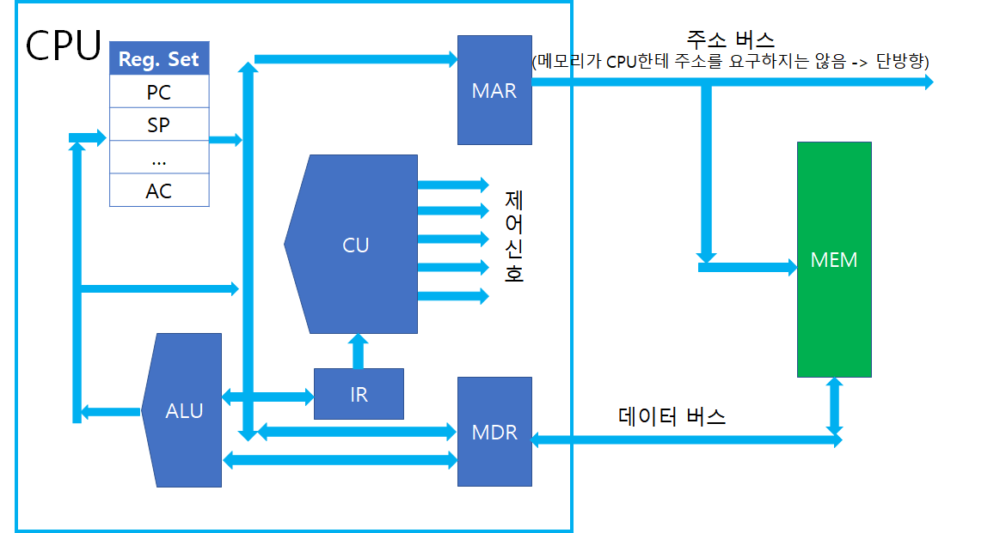

# CPU - MAR(Memory Address Register)

</img>

| **구분** | **주요 내용** |
| --- | --- |
| **명칭** | Memory Address Register (메모리 주소 레지스터) |
| **역할** | 접근하려는 메모리의 **주소(Location)**를 일시 보관 |
| **연결 통로** | 주소 버스 (Address Bus) |
| **신호 방향** | CPU $\rightarrow$ 메모리 (단방향) |
| **비트 수의 의미** | 시스템이 인식할 수 있는 최대 메모리 용량을 결정 |
| **파트너 레지스터** | MBR (Memory Buffer Register: 실제 데이터를 보관) |

## **정의**

- CPU 내부의 연산 유닛과 외부 주기억장치(RAM) 사이에서 '주소 통로' 역할을 하는 매우 중요한 특수 목적 레지스터
- CPU가 읽거나 쓰려고 하는 메모리(RAM)의 주소(Address)를 일시적으로 저장하는 레지스터
- CPU 내부의 제어장치(Control Unit)나 프로그램 카운터(PC)가 몇 번지 메모리에 접근해야 하라고 명령을 내리면, 해당 메모리 주소가 주소 버스(Address Bus)로 나가기 직전에 머무르는 대기소 역할.

## **기능**

- **메모리 주소의 일시 저장** : 명령어를 읽어오거나(Fetch), 데이터를 메모리에 저장/호출할 때 해당 메모리 번지를 주소 버스로 출력하기 전까지 보관.
- **주소 버스(Address Bus)와의 직접 연동** : MAR에 저장된 값은 물리적인 통로인 주소 버스를 통해 메모리 컨트롤러로 전달.
- **읽기/쓰기 작업의 출발점** :
    - **읽기(Read)** : MAR에 저장된 주소로 가서 해당 위치의 데이터를 MBR(Memory Buffer Register)로 가져옴.
    - **쓰기(Write)** : MBR에 있는 데이터를 MAR이 가리키는 주소의 메모리 위치에 저장.

## **특징**

- **단방향 데이터 흐름** : MAR의 주소 값은 항상 CPU에서 메모리 방향으로만 이동. (메모리가 CPU의 MAR로 주소를 역으로 보낼 수는 없음.)
    - **주소 지정** : CPU가 RAM에서 특정 데이터를 찾고 싶을 때, 그 데이터가 있는 위치의 주소를 MAR에 보냄.
    - **버스 이동** : MAR에 저장된 주소는 주소 버스(Address Bus)를 타고 RAM으로 전달.
    - **데이터 교환** : RAM은 MAR이 가리키는 위치를 찾아 그곳의 데이터를 CPU에게 보냄.
- **시스템의 최대 메모리 용량 결정**: MAR의 크기(비트 수)는 컴퓨터가 가리킬 수 있는 메모리의 최대 물리적 주소 공간을 결정.
- **MBR(메모리 버퍼 레지스터)과의 콤비 작용** : MAR이 "어디로 가야 할지(주소)"를 담당한다면, MBR은 "무엇을 가지고 갈지/가져올지(데이터)"를 담당하여 항상 짝을 이루어 동작.