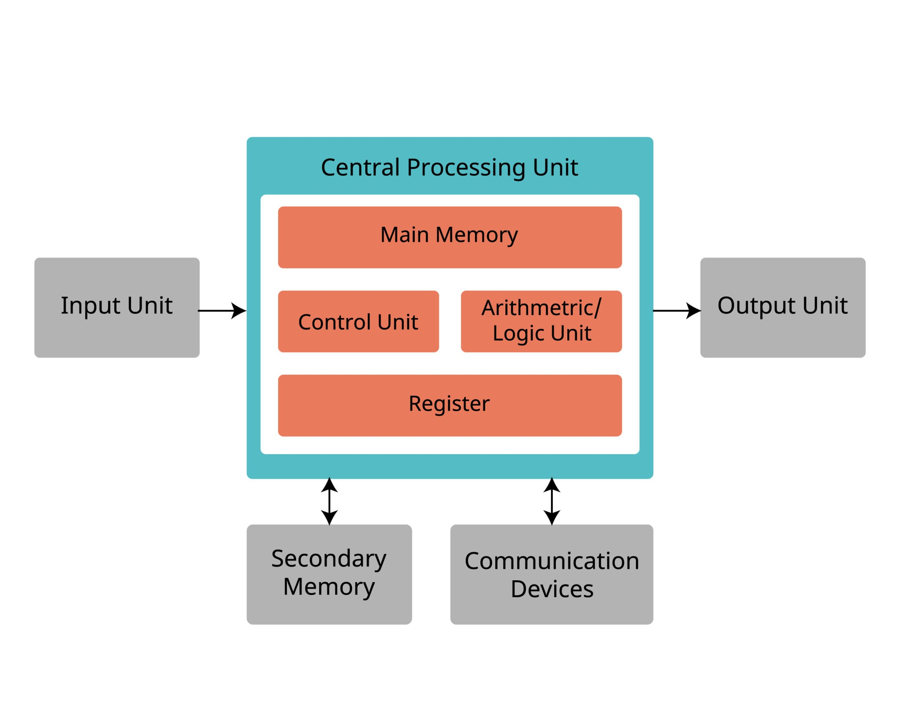

# CPU Register

</img>

| **구분** | **주요 내용** | **비고 / 예시** |
| --- | --- | --- |
| **정의** | CPU 내부에 위치한 초고속, 초소형 임시 기억 장치 | 메모리 계층 구조 최상단 위치 |
| **속도 및 용량** | **속도:** 컴퓨터 장치 중 가장 빠름 (1클럭 사이클 미만) **용량:** 극히 제한됨 (단일 레지스터당 32bit / 64bit) | 하드웨어 구조적 한계 및 비용 문제 |
| **주요 역할** | 연산 데이터 임시 저장, 명령어 주소 추적, CPU 상태 제어 | ALU, 제어장치의 징검다리 역할 |
| **OS 관점의 중요성** | 멀티태스킹 시 **컨텍스트 스위칭(Context Switching)**의 대상 | 프로세스 제어 블록(PCB)에 레지스터 상태를 백업/복원 |
| **핵심 종류** | • **PC:** 다음 실행할 명령어 주소 지정 • **IR:** 현재 실행 중인 명령어 보관 • **MAR/MDR:** 메모리 입출력 주소 및 데이터 버퍼 • **AC:** 연산 결과 누적 | 각 레지스터마다 고유의 독립적 임무 수행 |

## 정의

- CPU 레지스터는 CPU(중앙처리장치) 내부에 존재하는 최고 속도의 초소형 임시 기억 장치
- 메모리 계층 구조의 최상단에 위치
- 컴퓨터가 당장 실행해야 하는 명령어와 연산에 필요한 데이터, 그리고 현재 CPU의 상태를 아주 짧은 시간 동안 저장하는 역할
- 플립플롭(Flip-Flop)이나 SRAM 회로로 구성되어 있어 메인 메모리(RAM)와는 비교가 되지 않을 정도로 빠름.

## 주요 기능

- **데이터 및 연산 결과 임시 저장 :** 제어장치(Control Unit)나 산술논리연산장치(ALU)가 연산을 처리하는 동안, 그 중간값이나 최종 결과물을 잠시 저장.
- **주소 지정 및 추적 :** 다음으로 실행할 명령어의 메모리 주소를 기억하거나, 데이터가 저장된 메모리의 물리적/논리적 위치를 가리킴.
- **CPU 상태 제어 :** 현재 CPU가 수행 중인 작업의 상태(양수/음수 여부, 오버플로우 발생 여부, 인터럽트 제한 상태 등)를 기록하여 시스템의 흐름을 제어.

## 핵심 특징

### ① 극단적인 속도와 작은 용량

- 레지스터는 CPU 코어와 동일한 클럭 사이클로 작동하므로 지연 시간(Latency)이 거의 없음.(RAM이 데이터를 가져오는 데 수십 나노초(ns)가 걸린다면, 레지스터는 1나노초 미만)
- 반면 비싼 반도체 소자를 사용하고 CPU 내부 공간이 제한적이기 때문에, 용량은 기껏해야 몇십 비트(32비트 또는 64비트)에서 수 킬로바이트 수준으로 매우 작다.

### ② 컨텍스트 스위칭(Context Switching)의 핵심 요소

- 운영체제가 여러 프로세스를 번갈아 실행할 때(멀티태스킹), 현재 실행 중인 프로세스의 레지스터 값들을 그대로 보존해야 다음 차례에 이어서 작업할 수 있다. 이 레지스터들의 집합을 컨텍스트(Context, 문맥)라고 함.
- OS는 프로세스가 바뀔 때마다 기존 레지스터 값을 메모리(PCB)에 저장하고 새 프로세스의 레지스터 값을 CPU에 복원하는 '컨텍스트 스위칭'을 수행.

### ③ 용도에 따른 철저한 분화

레지스터는 아무 데이터나 막 넣는 곳이 아니라, 목적에 따라 엄격하게 분류되어 작동.

- **프로그램 카운터 (PC, Program Counter) :** 다음에 실행할 명령어의 주소를 가리킴.
- **명령어 레지스터 (IR, Instruction Register) :** 현재 실행 중인 명령어를 저장.
- **메모리 주소 레지스터 (MAR) :** 읽거나 쓰려는 메모리의 주소를 보관.
- **메모리 버퍼 레지스터 (MBR / MDR) :** 메모리에서 읽어왔거나 메모리에 쓸 데이터를 보관.
- **누산기 (AC, Accumulator) :** 산술 및 논리 연산의 중간 결과를 임시로 저장.