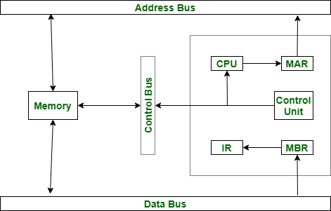

# MBR(Memory Buffer Register)

</img>

| **구분** | **주요 내용** |
| --- | --- |
| **풀네임 / 동의어** | Memory Buffer Register (MDR: Memory Data Register) |
| **핵심 역할** | CPU와 주기억장치 간 데이터 입출력 시 임시 보관함 |
| **연결 버스** | 데이터 버스 (Data Bus) |
| **전송 방향** | 양방향 (CPU ↔ Memory) |
| **크기** | 데이터 버스의 폭(비트 수)과 동일 |
| **주요 상호작용 대상** | MAR (주소 지정), IR (명령어 전달), AC/ALU (연산 데이터 전달), Control Unit (제어 신호) |

## 정의

- CPU와 메인 메모리(RAM) 사이에서 실제 데이터나 명령어를 임시로 거쳐가는 관문 역할을 하는 핵심 레지스터
- 주기억장치(RAM)로부터 읽어온 데이터/명령어나, 주기억장치에 쓰기(저장) 위해 전달되는 데이터가 반드시 거쳐 가는 임시 저장용 레지스터
- CPU와 메모리 사이를 오가는 택배물(데이터)이 잠시 머무르는 대기실 역할

## 기능

- **메모리 읽기 (Read operation) 버퍼링 :** 주기억장치에서 가져온 명령어나 데이터를 CPU 내부로 전달하기 직전 임시 보관.
- **메모리 쓰기 (Write operation) 버퍼링 :** CPU(연산장치 등)가 처리한 결과값을 주기억장치로 보내어 저장하기 직전 임시 보관.
- **데이터 버스(Data Bus)와의 인터페이스 :** CPU 내부 데이터 버스와 외부 시스템 데이터 버스 사이에서 신호 및 데이터 타이밍을 중계.

## 특징

- **양방향성 (Bidirectional) :** 주소 레지스터(MAR)가 메모리로만 향하는 단방향인 것과 달리, MBR은 읽기(Inbound)와 쓰기(Outbound)가 모두 가능하므로 양방향 통로로 작동.
- **데이터 버스 폭과 크기 일치 :** MBR의 크기(비트 수)는 컴퓨터 아키텍처의 데이터 버스(Data Bus)의 폭(Width)과 정확히 동일. (예: 64비트 시스템에서는 MBR도 64비트)
- **내용의 다양성 (Data or Instruction) :** MBR에 담기는 데이터는 실행할 명령어 코드(Opcode/Operand)일 수도 있고, 연산에 쓰일 순수 데이터(Data)일 수도 있다.

## 다른 레지스터와의 상호 작용

### **① 메모리 읽기 동작 (Fetch/Read)**

1. **PC (Program Counter) → MAR** : 읽어올 메모리 주소를 MAR로 보냄.
2. **MAR → Address Bus → Memory** : MAR이 주소 버스를 통해 메모리 주소를 지정.
3. **Memory → Data Bus → MBR** : 메모리에서 읽어온 데이터/명령어가 데이터 버스를 거쳐 MBR에 들어옴.
4. **MBR의 분기 처리**:
    - 읽어온 내용이 명령어라면 **→** IR (Instruction Register, 명령어 레지스터)로 전달되어 제어장치가 해독.
    - 읽어온 내용이 데이터라면 **→** AC (Accumulator, 누산기) 또는 일반 목적 레지스터로 전달되어 ALU (연산장치)에서 계산됨.

### **② 메모리 쓰기 동작 (Store/Write)**

1. **ALU / AC → MBR** : 저장할 결과 데이터를 MBR에 기록.
2. **PC / CPU → MAR** : 저장할 메모리 위치(주소)를 MAR에 기록.
3. **MBR & MAR → Memory** : MAR은 주소 버스로 위치를 알리고, MBR은 데이터 버스를 통해 실제 데이터를 메모리에 기록.