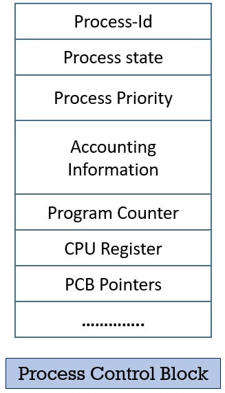

# PCB(Process Control Block)

</img>

| **구분** | **주요 내용** | **비유 및 설명** |
| --- | --- | --- |
| **정의** | 운영체제가 프로세스를 관리하기 위해 생성하는 **자료구조** | 프로세스의 **'주민등록증'** 또는 **'인사기록카드'** |
| **저장 위치** | 메모리의 **커널 영역(Kernel Space)** | 보안을 위해 일반 프로그램이 접근할 수 없는 OS 전용 공간 |
| **생명 주기** | 프로세스 생성 시 함께 생성
→ 프로세스 종료 시 함께 소멸 | 프로세스의 시작과 끝을 함께하는 운명 공동체 |
| **필요한 이유** | **문맥 교환(Context Switching)** 시 이전 작업 상태를 복원하기 위함 | "내가 아까 어디까지 실행했더라?"를 기억하기 위한 기록장 |
| **핵심 포함 정보** | PID(식별 번호), 프로세스 상태, 프로그램 카운터(PC), 레지스터 값, 메모리 관리 정보 등 | 프로세스의 현재 실행 위치와 사용 중인 자원의 스냅샷 |
| **관리 방식** | **연결 리스트(Linked List)** 구조로 관리 | Ready 큐, Wait 큐 등에 PCB들을 줄 세워 순차적으로 처리 |

## 정의

- 운영체제가 시스템 내의 프로세스를 관리하기 위해 사용하는 핵심 자료구조
- 운영체제 커널 영역에서 관리되며, 프로세스의 모든 행동 지침과 기록이 이곳에 보관

## PCB가 필요한 이유: 문맥 교환(Context Switching)

> 컴퓨터로 유튜브를 보면서 코딩을 하고 메신저를 쓸 수 있는 이유는, CPU가 이 프로세스들을 아주 빠른 속도로 번갈아가며 실행하고 있기 때문
⇒ 다중 프로그래밍(Multi-programming) 환경
> 

</img>

#### **문맥 교환(Context Switch)이란?**

- 실행 중인 프로세스의 상태(문맥)를 PCB에 저장하고, 다음에 실행할 프로세스의 PCB로부터 상태를 복원하여 CPU를 전환하는 과정

```csharp
[A 프로세스 실행 중]
      ↓ (인터럽트 발생 또는 할당 시간 만료)
1. OS가 CPU의 제어권을 잡음
2. OS가 현재 CPU 레지스터에 있던 A의 중간 작업 값들을 "A의 PCB"에 저장 (백업)
3. OS가 다음에 실행할 "B의 PCB"에서 이전 작업 값들을 CPU 레지스터로 로드 (복원)
      ↓ 
[B 프로세스 실행 시작]
```

- PCB가 없다면 CPU는 이전에 하던 작업을 기억하지 못하므로, 프로세스를 교체할 때마다 처음부터 다시 실행해야 하는 참사가 벌어짐

## PCB에 담기는 주요 정보

OS와 아키텍처에 따라 조금씩 다르지만, 일반적으로 다음과 같은 정보들을 포함

- **프로세스 식별자 (PID, Process ID) :** 시스템 내에서 프로세스를 고유하게 구분하기 위한 ID 번호
- **프로세스 상태 (Process State) :** 현재 프로세스가 어떤 상태인지 (생성(Create), 준비(Ready), 실행(Running), 대기(Waiting), 종료(Terminated) 등)
- **프로그램 카운터 (PC, Program Counter) :** 이 프로세스가 다음에 실행할 명령어의 메모리 주소
- **CPU 레지스터 정보 :** 누산기(Accumulator), 인덱스 레지스터, 스택 포인터 등 CPU 내부 레지스터에 남아있던 중간 계산 값들. 문맥 교환 시 가장 먼저 백업되는 정보.
- **CPU 스케줄링 정보 :** 프로세스의 우선순위, 스케줄링 큐에 대한 포인터 등 OS 스케줄러가 참고할 정보
- **메모리 관리 정보 :** 프로세스가 차지하고 있는 메모리의 범위(Base/Limit 레지스터 값), 페이지 테이블 또는 세그먼트 테이블 정보
- **입출력 상태 정보 :** 프로세스가 할당받은 I/O 장치 목록, 현재 열어두고 사용 중인 파일(File Descriptor) 목록 등이 포함.

## PCB의 핵심 기능과 작동 특징

### ① 생성과 소멸의 라이프사이클

- PCB는 프로그램이 실행되어 프로세스가 생성될 때 커널 영역에서 만들어지고, 프로세스가 완전히 종료(Terminated)되면 커널 메모리에서 삭제됨.

### ② 연결 리스트(Linked List) 기반의 관리

운영체제는 수많은 PCB를 효율적으로 관리하기 위해 Linked List 구조를 사용합니다.

- CPU를 기다리는 Ready 상태의 PCB들은 Ready Queue(준비 큐)에서 준비.
- 디스크 읽기나 키보드 입력 같은 I/O 작업을 기다리는 PCB들은 해당 장치의 Wait Queue(대기 큐)에 연결되어 대기.
- OS는 스케줄링 알고리즘에 따라 이 큐에서 PCB를 하나씩 꺼내어 CPU에 할당.

### ③ 커널 메모리(Kernel Space) 보호

- PCB는 일반 사용자가 임의로 수정할 수 없도록 커널 영역의 주소 공간에 저장.
- 프로세스가 자기 자신의 PCB를 직접 수정하는 것은 불가능하며, 오직 운영체제(OS)만이 접근하고 업데이트 가능.