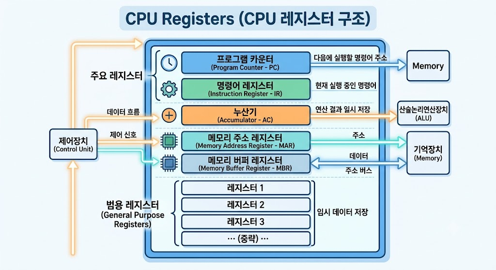

# CPU Register - PC(Program Counter)

</img>

| **구분** | **주요 내용** |
| --- | --- |
| **정의** | CPU 제어 장치 내부에서 다음에 실행할 명령어의 메모리 주소를 보관하는 레지스터 |
| **동의어** | Instruction Pointer (IP) - 주로 Intel x86 계열에서 사용 |
| **기본 동작** | 명령어를 인출(Fetch)한 직후, 다음 명령어의 길이만큼 자동으로 주소 값 증가 (Increment) |
| **제어 변경** | 조건문, 반복문, 함수 호출 시 해당 목적지 주소로 값이 강제 업데이트 (Jump/Branch) |
| **결정 요인** | PC의 비트 수(32비트/64비트)가 곧 CPU가 가리킬 수 있는 최대 메모리(RAM) 주소 범위를 결정 |

## 정의

- CPU 내부의 제어 장치(Control Unit)에 위치한 특수 목적 레지스터로, '다음에 실행할 명령어의 메모리 주소'를 저장하는 공간
- 컴퓨터 프로그램은 메모리(RAM)에 일렬로 저장되어 있고, CPU는 이를 한 줄씩 읽어서 실행하는데, CPU가 길을 잃지 않고 순서대로 작업을 처리할 수 있도록 다음 목적지를 기억해 주는 역할

## 기능

PC는 CPU의 핵심 작동 주기인 명령어 인출-해독-실행(Fetch-Decode-Execute Cycle) 단계에서 가장 먼저 작동

- **순차적 주소 지정 (Auto-Increment) :**
    - CPU가 현재 PC가 가리키는 주소에서 명령어를 가져오면(Fetch), PC는 자동으로 다음 명령어가 있는 주소로 값이 증가
    - 증가하는 크기는 CPU의 워드(Word) 크기나 명령어 길이에 따라 다름.(예: 32비트 명령어 환경이면 +4바이트). 즉, 명령어를 '읽자마자' 이미 다음 줄을 준비.
- **분기 및 제어 흐름 변경 (Branching) :**
    - 조건문(`if`), 반복문(`for`), 함수 호출(`call`) 등을 만나면 코드의 다른 위치로 건너뛰어야 함.
    - 이때 제어문이 실행되면 PC에 순차적인 다음 주소 대신 이동할 대상의 목적지 주소가 직접 덮어씌워짐.

## 특징

- **포인터 역할을 수행 :** 데이터를 저장하는 일반 레지스터(General Purpose Register)와 달리, 오직 메모리의 '주소(Address)'만을 담는다.
- **비트 수와 메모리 용량의 관계 :** PC가 몇 비트짜리 레지스터냐에 따라 CPU가 한 번에 접근할 수 있는 최대 메모리 주소 공간이 결정됨.
    - 32비트 CPU의 PC는 $2^{32}$ 바이트 (4GB)까지 주소 지정 가능.
    - 64비트 CPU의 PC는 $2^{64}$ 바이트까지 주소 지정 가능.
- **파이프라이닝(Pipelining)에서의 실제 값:** 현대 CPU는 속도를 높이기 위해 여러 명령어를 동시에 처리(파이프라이닝). 이 때문에 실제로 사용자가 보는 '현재 실행 중인 명령어 위치'와 'PC가 가리키는 주소' 사이에 약간의 간격(Offset)이 존재할 수 있음.